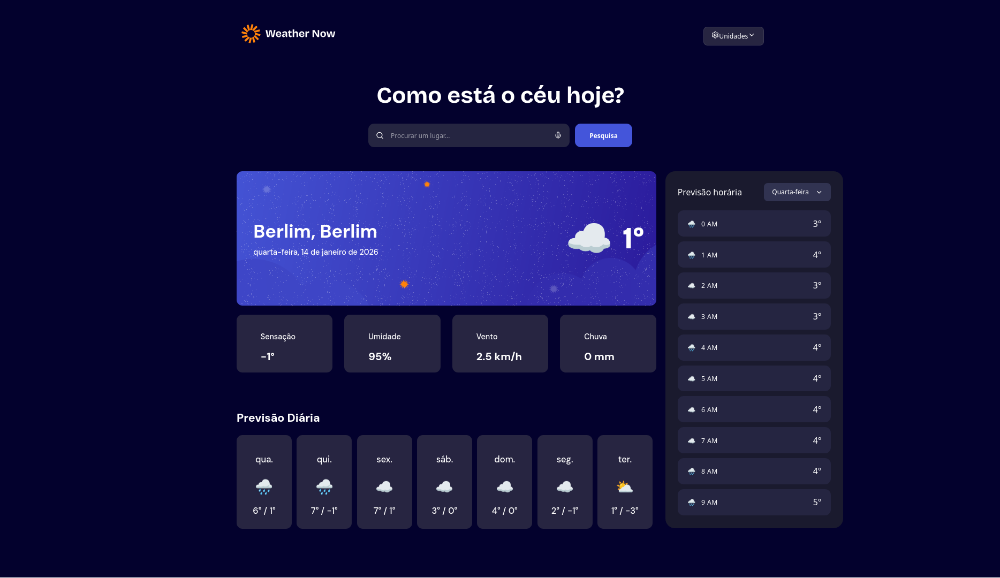

# 🌦️ Weather App - Frontend Mentor Solution

Esta é a minha solução para o [desafio de App de Previsão do Tempo do Frontend Mentor](https://www.frontendmentor.io/challenges/weather-app-K1FhddVm49). O foco deste projeto foi criar um dashboard meteorológico altamente responsivo e funcional.

## 📋 Sumário

- [Visão Geral](#-visão-geral)
  - [O desafio](#-o-desafio)
  - [Screenshot](#-screenshot)
- [Meu processo](#-meu-processo)
  - [Tecnologias utilizadas](#-tecnologias-utilizadas)
  - [O que eu aprendi](#-o-que-eu-aprendi)
- [Como rodar o projeto](#-como-rodar-o-projeto)
- [Autor](#-autor)

---

## 👁️ Visão Geral

### 🚀 O desafio

Os usuários podem:
- Buscar por cidades ao redor do mundo.
- Ver as condições atuais (temperatura, sensibilidade térmica, umidade, vento e precipitação).
- Alternar entre **Unidades Métricas (Celsius, km/h)** e **Imperiais (Fahrenheit, mph)**.
- Visualizar previsão horária para diferentes dias da semana.
- Experiência otimizada para Desktop, Tablet e Mobile.

### 📸 Screenshot

*()*

---

## 🛠️ Meu processo

### 🧰 Tecnologias utilizadas

- **React.js** (com Vite)
- **CSS3** (Variáveis, Grid e Flexbox)
- **Open-Meteo API** (Dados meteorológicos gratuitos)
- **Lucide React** (Ícones modernos)
- **Mobile-First Workflow**

### 💡 O que eu aprendi

Neste projeto, aprofundei meus conhecimentos em manipulação de estados complexos no React, especialmente para sincronizar diferentes unidades de medida (Temperatura, Vento e Chuva) em todos os componentes simultaneamente.

Também foquei em **Acessibilidade e UX**, criando estados de `hover` e `focus` claros: